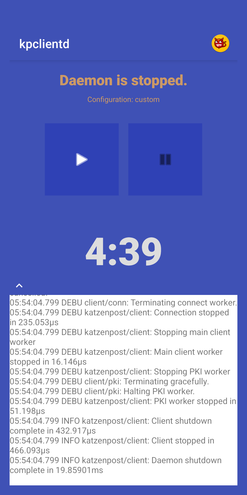
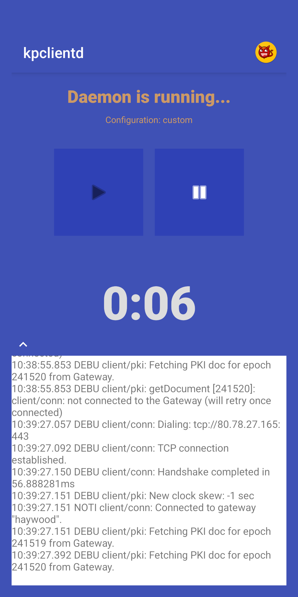

# kpclientd-android

Run [Katzenpost](https://github.com/katzenpost/katzenpost) client daemon
`kpclientd` on Android devices.

## License

Copyright (C) 2026-present, Bernd Fix   >Y<

'kpclientd-android' is free software: you can redistribute it and/or modify
it under the terms of the GNU Affero General Public License as published
by the Free Software Foundation, either version 3 of the License,
or (at your option) any later version.

'kpclientd-android' is distributed in the hope that it will be useful,
but WITHOUT ANY WARRANTY; without even the implied warranty of
MERCHANTABILITY or FITNESS FOR A PARTICULAR PURPOSE.  See the GNU
Affero General Public License for more details.

You should have received a copy of the GNU Affero General Public License
along with this program.  If not, see <http:www.gnu.org/licenses/>.

SPDX-License-Identifier: AGPL3.0-or-later

## Caveat

THIS IS WORK-IN-PROGRESS AT A VERY EARLY STATE. DON'T EXPECT ANY COMPLETE
DOCUMENTATION OR COMPILABLE, RUNNABLE OR EVEN OPERATIONAL SOURCE CODE.

## Prerequisites

* arm64-based device with Android 13+ (recommended: Android 16)
* rooted device (command `su` is available and usable **within** apps);
this usually requires `magisk` to be [installed](https://github.com/topjohnwu/Magisk)
on the device.
* a cloned Katzenpost repo
* Go 1.26+
* Java 17+
* Android SDK and NDK installed
* Gradle

## Building the app

The app contains two separate parts:

* the `kpclientd` daemon that connect to the Katzenpost mixnet and serves
client requests over an interface (Unix socket, TCP).

* the GUI where the daemon can be started / stopped.

### Compiling kpclientd

If your cloned [Katzenpost repo](https://github.com/katzenpost/katzenpost)
is not located at `/usr/local/src/katzenpost` or you use a different version
of the Android NDK (not `28.0.13004108`), you need to change the build
script for the daemon. Copy `mk_daemon` to `mk_daemon_local` and edit the
lines `KATZENPOST_REPO=...` and `ASDK=...`.

To build the program, run:

```bash
./mk_daemon_local
```

The command displays the resulting file properties at the end of the build.
The file size should be around 31MB.

### Building the GUI app

#### Setting up gradle

You need `gradle 9.5.0` to build the app. To install the gradle wrapper:

```bash
cd ./apk/
mv settings.gradle settings.gradle.x
mv build.gradle build.gradle.x
gradle wrapper --gradle-version 9.5.0
mv settings.gradle.x settings.gradle
mv build.gradle.x build.gradle
cd ..
```

#### Preparing for build

If you need to customize settings in `mk_apk`, copy `mk_apk` to `mk_apk_local`
and edit it:

```toml
ASDK=/usr/lib/android-sdk/build-tools/34.0.0
KEYSTORE=/usr/local/src/keystore.jks
KEY=dev
```

If you have no keystore yet (to store keys required to sign APKs), create one
in a folder of your choice and set the location in the file above:

```bash
keytool -genkey -v \
  -keystore <folder>/keystore.jks -alias dev \
  -keyalg RSA -keysize 2048 -validity 10000
```

You also need to create an output folder:

```bash
mkdir ./apk/deploy
```

#### Building and installing the APK

To build the APK, run the following commands:

```bash
./mk_apk_local
```

After a successful build the APK will be signed with the `dev` key
in the Java keystore.

You can add the `+deploy` argument if you want the build script to upload
the resulting binaries (`kpclientd.apk` and `kpclientd-debug.apk`) to the
`Download` folder on a device:

```bash
./mk_apk_local +deploy
```

### Running the app

Install the `kpclientd.apk` on your device, but don't open it yet.

The daemon requires a configuration file (usually called `client.toml`) to
successfully connect to the Katzenpost mixnet. A config file is built-in,
but it may be outdated the time you want to run the daemon.

Because this file is currently not public (it resides in a private repository
`github.com/katzenpost/namenlos`) you need to contact the Katzenpost project
and ask for a new version. Copy the new `client.toml` to the `/sdcard/Download`
folder on your device, where the daemon will pick it up at start time.

Click on the app icon to open the GUI. Below the title line you see a line like
`Configuration: ...` where either `built-in` or `custom` is specified.

### Using the app

If the app ist started it will display the following screen:




There are two buttons to start and stop the daemon and the elapsed time in
either state is displayed below (format "&lt;hrs&gt;:&lt;mins&gt;").

You can toggle the log view with the chevron button above the window.
